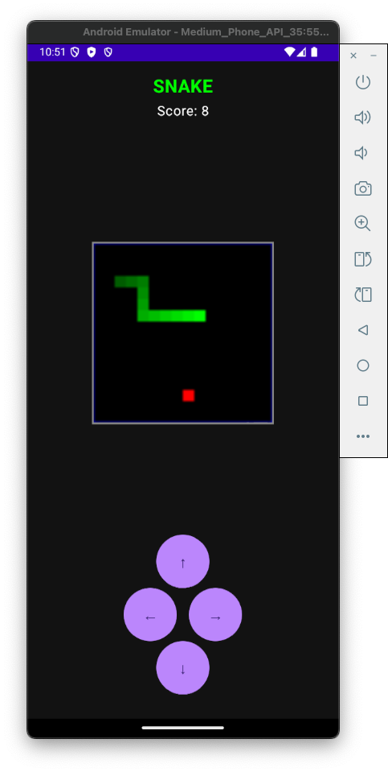
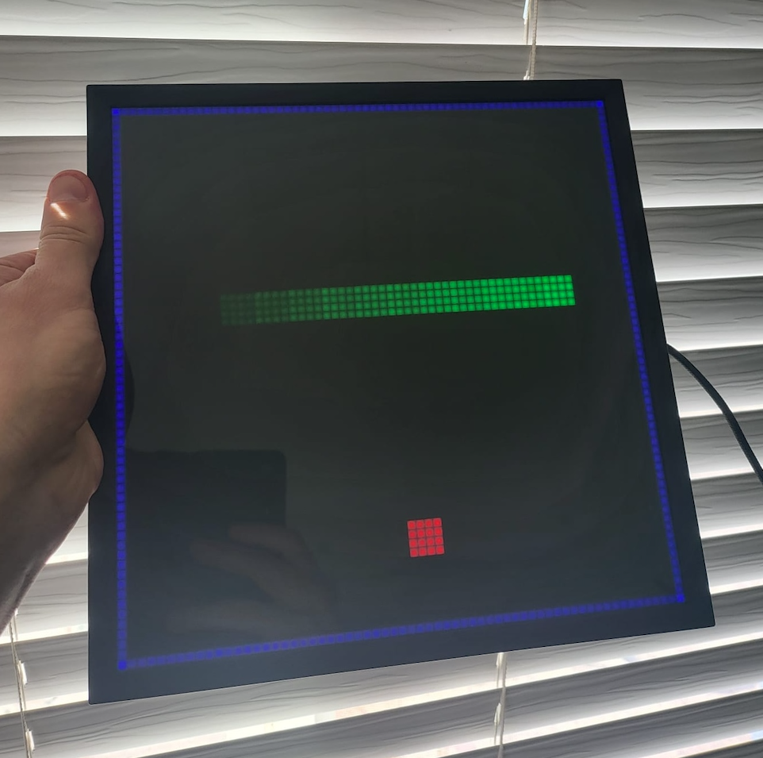

# Pixoo Snake

A Snake game for the Pixoo 64 LED display, controlled via Android app. Written using Cursor.

## Game Description

Snake is a classic arcade game where you control a snake that grows longer as it eats food. The goal is to eat as much food as possible without colliding with yourself.

<table>
<tr>
<td valign="top"></td>
<td valign="top"></td>
</tr>
</table>

- Use the arrow buttons to control the direction of the snake
- Eat the red food to grow longer and increase your score
- Avoid colliding with yourself
- The snake can wrap around the edges of the screen

## Development Setup on MacOS

1. Clone this repository
2. Run the setup script to install dependencies:
   ```bash
   ./setup.sh
   ```
   This will install Homebrew (if needed), Java 17, Android Studio, set up Android SDK, create an Android Virtual Device, and configure environment variables.

3. After setup completes:
   - Restart your terminal to apply environment variables
   - Open Android Studio and complete the initial setup
   - Run the app with `./run_in_emulator.sh`

## Emulator Management

The following scripts help manage the Android emulator:

- **Start**: `./start_emulator.sh` - Starts the emulator in the background
- **Stop**: `./stop_emulator.sh` - Stops the running emulator
- **Reset**: `./reset_emulator.sh` - Performs a soft reset of the emulator

## Building

Build a local APK:
```bash
./build_apk.sh
```

## Debugging

View logs from the emulator:
```bash
# Show all logs
./tail_logs.sh

# Show only Pixoo-related logs
./tail_logs.sh -p

# Show only game-related logs
./tail_logs.sh -g

# Clear log buffer before showing logs
./tail_logs.sh -c
```

## TODOs

- The JAVA_HOME env variable is hardcoded in the scripts, which isnt very portable.
- The app crashes if the Pixoo device cant be found on local wifi.
